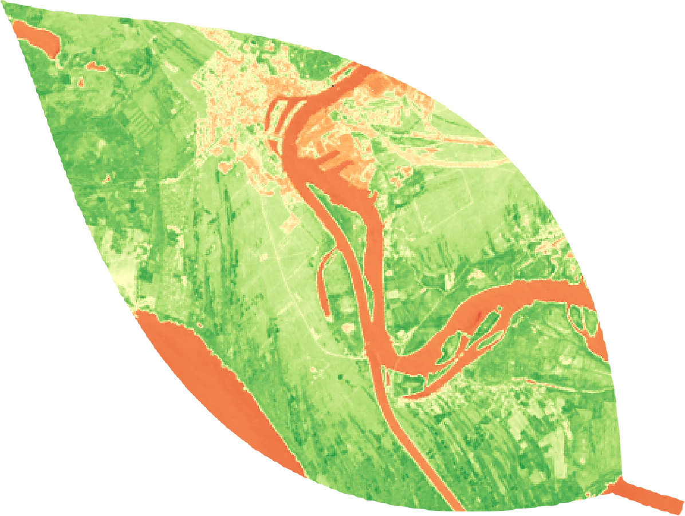
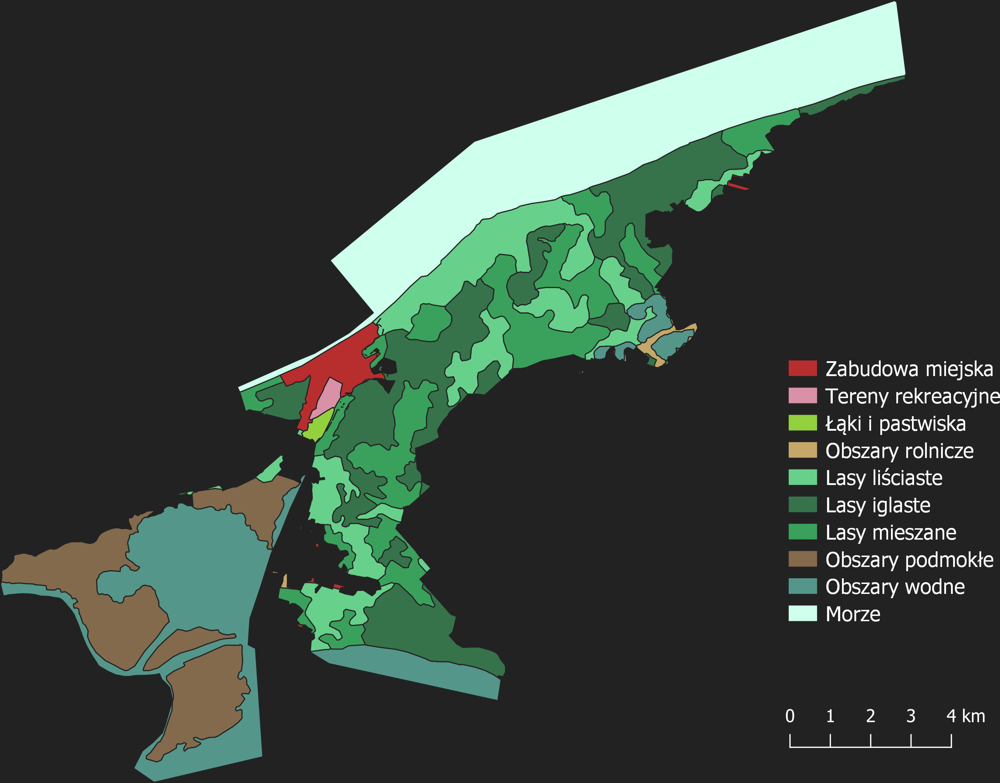
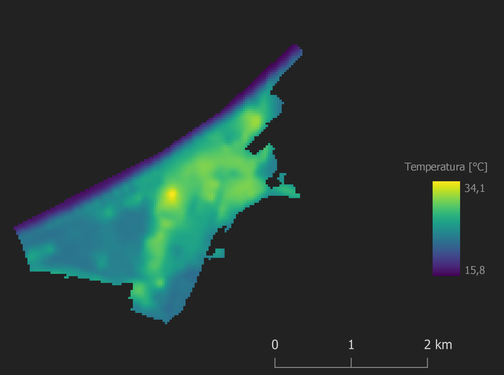
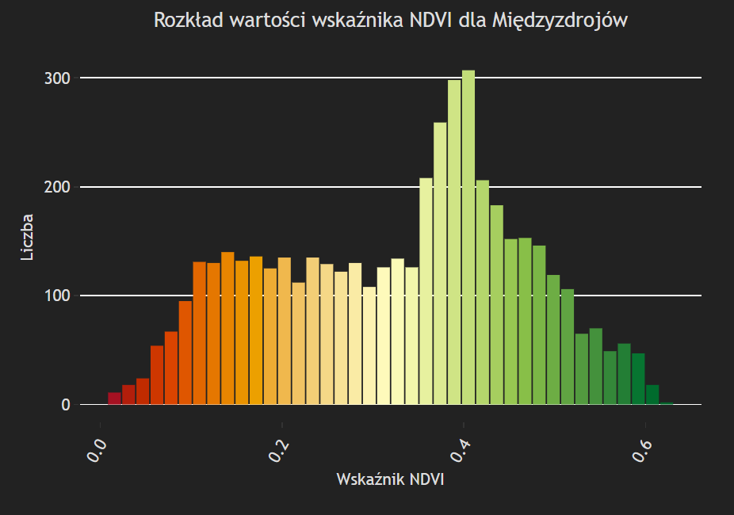
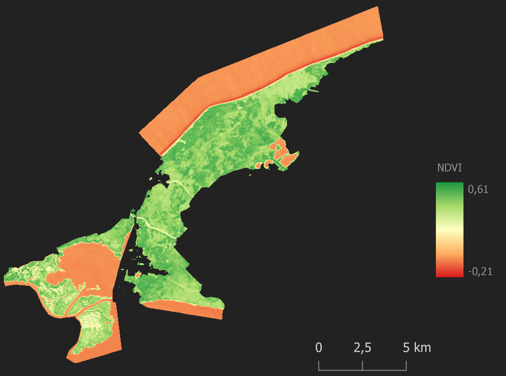
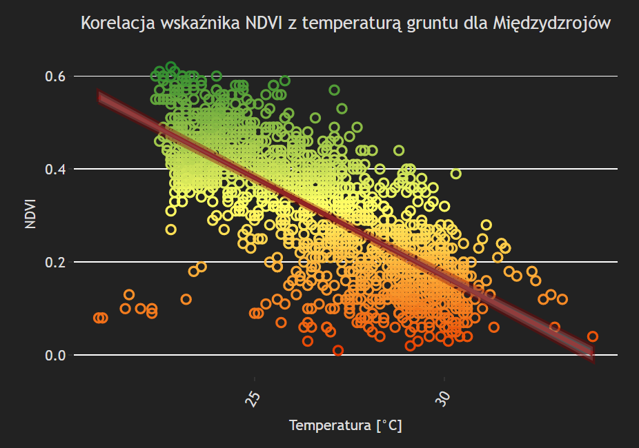
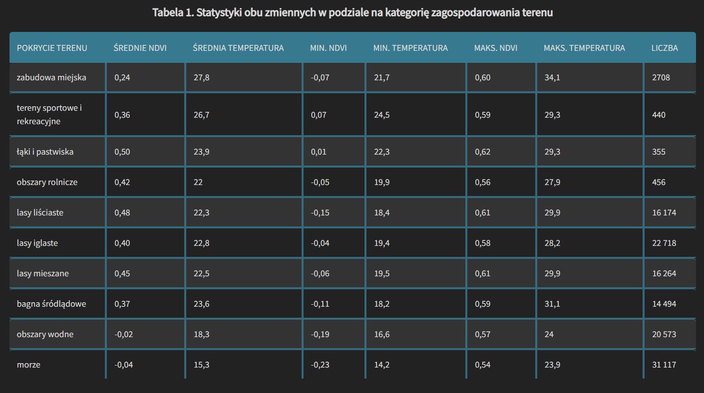

# Ocena korelacji wskaźnika NDVI z temperaturą gruntu oraz zagospodarowaniem terenu dla Wolińskiego Parku Narodowego i Międzyzdrojów

 
https://adrian-nowacki.github.io/ocena-korelacji-NDVI/ 
 

## Spis treści
* [Opis](#opis)
* [Dane](#dane)
* [Analiza](#analiza)

 

## Opis
&nbsp;&nbsp;&nbsp;&nbsp;&nbsp;&nbsp;&nbsp;&nbsp; Celem projektu była statystyczna ocena korelacji znormalizowanego różnicowego wskaźnika wegetacji oraz temperatury gruntu z zagospodarowaniem terenu dla Wolińskiego Parku Narodowego i miasta Międzyzdroje. Publikacja jest efektem końcowym projektu naukowego realizowanego w ramach wyjazdu na Obóz Naukowy w Białej Górze przez Sekcję Geoinformacji Studenckiego Koła Naukowego na Uniwersytecie im. Adama Mickiewicza w Poznaniu.

 

## Dane
* ***[Landsat 8](https://www.usgs.gov/)*** – zobrazowanie satelitarne w celu obliczenia temperatury gruntu oraz wskaźnika NDVI
* ***[CORINE Land Cover 2018(CLC2018)](https://land.copernicus.eu/pan-european/corine-land-cover/clc2018)*** – dane wektorowe zagospodarowania terenu
* ***[OpenStreetMap](https://www.openstreetmap.org/)*** – granice administracyjne WPN i Międzyzdrojów

 

## Analiza

* **Klasyfikacja kategorii pokrycia terenu**

 

* **Obliczenie temperatury gruntu**

* **Rozkłady wartości temperatury i wskaźnika NDVI**

 

* **Obliczenie wartości wskaźnika NDVI**

 

* **Korelacja temperatury ze wskaźnikiem NDVI**

 

* **Statystyki zmiennych dla poszczególnych kategorii pokrycia terenu**

 

